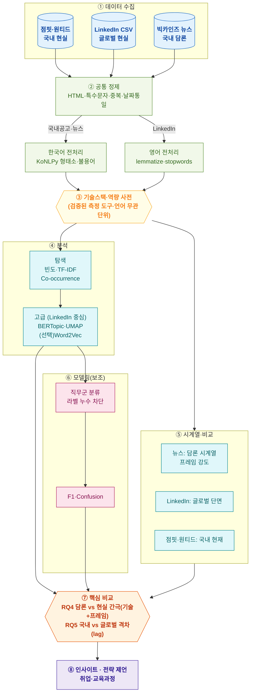

# 생성형 AI 시대 IT 채용시장의 요구역량과 채용 담론 변화 분석

점핏·원티드 채용공고 · LinkedIn 채용공고 데이터 · 뉴스 텍스트마이닝 기반 연구 기획서

---

## 1. 한눈에 보기

| 항목 | 내용 |
|---|---|
| 연구 질문(핵심) | 언론은 "AI가 개발자를 대체한다"고 말한다. **실제 채용공고도 그렇게 말하는가?** |
| 접근 | 뉴스(국내 담론)·국내공고(점핏+원티드, 국내 현실)·LinkedIn(글로벌 현실) **3축**으로 ① 담론 vs 현실 간극(RQ4) ② 국내 vs 글로벌 격차(RQ5) 검증 |
| 데이터 규모 | 국내 공고 ~3,300 + LinkedIn(IT 수만) + 뉴스(수천) → **전체 수만 건+** (권장 5,000 초과) |
| 핵심 방법론 | 검증된 기술스택 사전 · **간극지수(2트랙)** · TF-IDF · Co-occurrence · BERTopic · UMAP · (선택)Word2Vec · 직무군 분류(보조) |
| 핵심 산출물 | **기술스택 간극지수 · 담론 프레임 지수**, 국내-글로벌 역량 격차, 직무군별 요구역량 지형도, 취업 전략 제언 |
| 가산점 | 공개 JSON API 호출 + 직접 크롤링 · 임베딩/BERTopic · 시의성 도메인 · 통계 근거 · 단일 메시지 발표 |
| 팀 구성 | 4명 |

본 연구의 한 문장 정의:

> **"AI 시대 IT 채용공고의 실제 요구역량은 언론 담론과 얼마나 일치하며, 국내는 글로벌과 얼마나 차이 나는가?"** 를 채용공고·뉴스 텍스트마이닝으로 정량 검증한다.

---

## 2. 연구 배경 및 문제의식

생성형 AI(ChatGPT, GitHub Copilot, LLM 기반 자동화)의 확산은 개발자 채용시장을 빠르게 바꾸고 있다. 언론에서는 "AI가 주니어 개발자를 대체한다", "개발자 채용이 위축된다", "AI 인재 수요가 폭증한다"는 담론이 반복된다.

그러나 **언론 담론과 실제 채용공고의 요구역량 사이에는 간극이 존재할 가능성**이 있다. 실제 공고에서는 여전히 Java·Spring·JavaScript·React·SQL·AWS 같은 전통 실무 기술스택이 큰 비중을 차지할 수 있기 때문이다. 또한 **국내 채용시장이 글로벌 대비 AI/데이터 역량 수용에서 얼마나 차이(lag)를 보이는지**도 검증할 가치가 있다.

본 연구는 담론·국내 공고·글로벌 공고를 결합하여 "담론 vs 현실"과 "국내 vs 글로벌"을 함께 비교한다.

### 2.1 주제 선정 근거 (가산점 대상)

- **당사자성:** 팀원 전원이 IT 전공/취업 준비 당사자로, 직접 체감하는 문제에서 출발.
- **정량 근거:** 청년 체감실업률·구직단념청년(통계청), 20대 정신건강·번아웃 통계, 개발자 채용 둔화/AI 인재 수요 보고서 등으로 동기를 수치로 뒷받침. *(본문 작성 시 실제 수치·출처 인용)*
- **시의성:** 생성형 AI 확산(ChatGPT 2022-11 출시) 이후 변화는 현재진행형 이슈.

---

## 3. 연구 목적 및 연구 질문

### 3.1 연구 목적

1. 국내 IT 채용공고의 현재 요구역량 파악 (RQ1)
2. 글로벌 IT 공고(LinkedIn)의 요구역량·AI 역량 분포·추세 분석 (RQ2)
3. 국내 뉴스의 IT 채용·개발자 담론 변화(2021–2026) 분석 (RQ3)
4. **언론 담론과 실제 요구역량 간 간극 정량 비교 (RQ4, 핵심)**
5. **국내(점핏+원티드) vs 글로벌(LinkedIn) 요구역량 격차(lag) 분석 (RQ5)**
6. (보조) 채용공고 텍스트 기반 직무군 분류 및 직무군별 역량 차이 도출 (RQ6)

### 3.2 연구 질문

| # | 연구 질문 | 데이터 |
|---|---|---|
| RQ1 | 현재 국내 IT 공고가 가장 많이 요구하는 역량은? | 점핏·원티드 |
| RQ2 | 글로벌 IT 공고의 요구역량·AI 역량은 어떻게 나타나는가? | LinkedIn |
| RQ3 | 국내 뉴스의 개발자 채용 담론은 2021–2026 어떻게 변했나? | 뉴스 |
| **RQ4** | **언론 담론과 실제 요구역량은 일치하는가? (핵심)** | 뉴스 × 국내공고 |
| └ RQ4a | (기술스택 간극) 뉴스·공고에서 **기술/역량 용어**만 비교 시 불일치는? | 뉴스 × 국내공고 |
| └ RQ4b | (담론 프레임) 뉴스 내 **위기/대체/재편 프레임**은 얼마나 강한가? | 뉴스 |
| **RQ5** | **국내 vs 글로벌 요구역량 격차(lag)는 얼마나 되는가?** | 국내공고 × LinkedIn |
| RQ6 | (보조) 공고 텍스트로 직무군을 분류할 수 있는가? | 국내공고/LinkedIn |

> **RQ4를 2트랙으로 분리한 이유:** 프레임어(AI대체·일자리위기)와 기술토큰(SQL·Git)을 한 지표에 섞으면 비교 단위가 오염된다. **기술스택 간극(RQ4a)** 과 **담론 프레임 강도(RQ4b)** 를 따로 측정한다.

---

## 4. 데이터 설계

### 4.1 출처 및 접근 (수집 검증 완료)

| 데이터 | 엔드포인트/링크 | 접근/비용 |
|---|---|---|
| 점핏(Jumpit) 채용공고 | 목록 `https://api.jumpit.co.kr/api/positions` · 상세 `/api/position/{id}` | 공개 JSON, 무료 |
| 원티드(Wanted) 채용공고 | 목록 `https://www.wanted.co.kr/api/v4/jobs` (개발 세부 카테고리) · 상세 `/jobs/{id}` | 공개 JSON, 무료 |
| LinkedIn Job Postings 2023–24 | https://www.kaggle.com/datasets/arshkon/linkedin-job-postings | Kaggle 계정, 무료 |
| 빅카인즈(BIGKinds) | https://www.bigkinds.or.kr/ | 회원가입, 무료 |

> **참고:** 국내 채용공고는 개발자 잡보드(점핏·원티드)의 공개 JSON 엔드포인트를 호출해 직접 수집한다. "API 호출 + 직접 수집"에 해당해 가산점 대상이며, 점핏 `techStacks`·원티드 `skill_tags`가 구조화 제공되어 데이터 품질이 높다.

### 4.2 데이터 역할 분리 (설계의 척추)

| 데이터 | 역할 | 강점 | 한계 |
|---|---|---|---|
| 뉴스(빅카인즈) | 국내 **담론** 장기 시계열 | 2021–26, before/after 가능 | 실제 수요 아닌 "담론", 본문 200자 |
| 점핏·원티드 | 국내 **현실** (현재 요구역량) | 직접 수집, 구조화 스킬 태그 + 본문 | **현재 활성 공고만**(시계열·종료공고 불가) |
| LinkedIn | 글로벌 **현실** + 고급분석 무대 | 대규모(12.3만+), 본문·skills·날짜·과거 포함 | 해외/영어 데이터 |

```
뉴스      = 국내 담론   (2021~2026, before/after)
점핏·원티드 = 국내 현실   (2026 현재 활성 공고 스냅샷)
LinkedIn  = 글로벌 현실 (2023~2024 공고, 과거 포함, 고급분석 무대)

핵심 비교 ① [담론 vs 현실]  국내 간극   → RQ4 (기술스택 간극 + 담론 프레임)
핵심 비교 ② [국내 vs 글로벌] 수용 격차   → RQ5 (lag)
```

### 4.3 점핏·원티드 채용공고 (국내 현실)

국내 IT 채용공고는 개발자 잡보드 두 곳의 공개 JSON 엔드포인트를 직접 호출해 수집한다. 두 사이트 모두 **기술스택을 구조화 제공**하고 **직무 본문이 텍스트**로 와서, 사전 추출 오탐·이미지 문제가 거의 없다.

| 소스 | 수집 건수 | 주요 필드 | 비고 |
|---|---|---|---|
| 점핏 | **777** (전체 활성) | 제목·회사·**techStacks**·경력·학력·지역·주요업무·자격요건·우대사항·게시일·마감일·URL | dev 전용, techStacks 100% |
| 원티드 | **2,534** (개발 17개 세부 카테고리 합산·중복제거) | 제목·회사·**skill_tags**·company_tags·intro·main_tasks·requirements·preferred_points·마감일·URL | skill_tags ~49%(나머지 본문 추출), 본문 100% |
| **국내 합계** | **≈ 3,300** (점핏·원티드 (회사,제목)/id 중복제거 후) | | 최소 기준 500 크게 초과 |

- **수집 방식:** 점핏은 목록 페이지네이션→상세. 원티드는 부모 카테고리(개발)가 offset ~700에서 막혀, **세부 직무 17개 카테고리별로 수집→id 중복제거**로 2,534건 확보.
- **윤리/라이선스:** 학술용 소규모 수집, 요청 간 지연(0.35초), 출처 표시, 비상업·재배포 금지.

> **[확인됨] 국내 공고 = 2026년 현재 활성 스냅샷**
> 점핏 게시일 분포 **2026-04-30 ~ 2026-05-29**, 마감일 미래(~06월). 두 사이트 모두 **마감된 과거 공고는 API에서 사라져 수집 불가.**
> - **시계열 불가:** 국내 채용의 "변화(연도별)" 분석은 할 수 없다.
> - **대응:** "변화" 서사는 **뉴스(2021–26)·LinkedIn(2023–24)** 이 담당(역할 분리). 국내공고는 RQ1(현재 역량)·RQ4(담론 vs 현실)·RQ5(vs 글로벌)에서 **현재 단면**으로 사용.
> - **RQ4 공정 비교:** 뉴스 전 기간이 아니라 **2026/최근 뉴스 ↔ 2026 공고**로 시점 정렬(점핏이 정확히 2026-05라 깔끔).

### 4.4 LinkedIn Job Postings 2023–2024 (글로벌 현실 + 고급분석 무대)

- **출처:** Kaggle (arshkon/linkedin-job-postings).
- **검증:** 123,849건(2023–24). `postings`(title·**description**·work_type·location·`listed_time`) + `skills`/`skills_desc`/`industries`/`companies` 별도 파일. 날짜 컬럼으로 **월별 시계열 가능**, **종료/만료 공고도 포함**(`expiry`).
- **적극 활용(왜):** 본문이 풍부하고 skills가 구조화돼 BERTopic·UMAP·skills 분석의 품질이 가장 높다. 고급 방법론은 LinkedIn에서 수행하고 그 결과를 국내와 비교.
- **분석 직무군:** Software/Frontend/Backend/Fullstack Engineer, Data Scientist/Analyst, ML/AI Engineer, DevOps/Cloud/Security Engineer.
- **주의:** ChatGPT 출시(2022-11) **이후** 데이터만 포함 → "AI 이전 vs 이후" 비교 불가(뉴스 담당). LinkedIn은 "글로벌 현실 단면 + 2년 내 드리프트".

### 4.5 뉴스 데이터 (국내 담론)

- **출처:** 빅카인즈. 기간 2021-01 ~ 2026-05. AI 이전(21–22) vs 이후(23–26) 구분.
- **수집 키워드:** 개발자 채용, IT 채용, 주니어/신입 개발자, AI 개발자, AI 인재, 생성형 AI 채용, 개발자 감축, 개발자 연봉/수요, 소프트웨어/디지털/클라우드 인재 등
- **주의(교차검증 완료):** 빅카인즈는 ① 본문 **앞 200자까지만** 제공(저작권), ② 다운로드 **최대 20,000건/쿼리**. → 전체 본문 토픽모델은 부적합 → **제목 + 200자 리드 + 제공 키워드/요약문**을 분석 단위로 사용. 담론은 **키워드·프레임 빈도·시계열** 중심으로 분석.

---

## 5. 방법론적 원칙 (Validity Guardrails)

결과의 타당성을 좌우하는 5대 원칙. 어기면 분석량과 무관하게 결과가 무의미해진다.

1. **공정한 비교 축(RQ4):** 뉴스(추세)와 국내공고(스냅샷)를 직접 비교하지 않는다. **동일 시점(2026 뉴스 vs 2026 공고)** 끼리, **언어 무관 비교단위(기술스택 사전)** 로만 비교.
2. **비교 어휘 분리(RQ4):** 기술/역량 용어(SQL·Git·Python)와 담론 프레임어(AI대체·일자리위기)를 한 지표에 섞지 않는다. → RQ4a(기술 간극) / RQ4b(프레임 강도)로 분리.
3. **언어 장벽 인정:** 한국어(국내공고/뉴스)와 영어(LinkedIn)의 **토픽 모델 결과를 직접 비교하지 않는다.** 비교 가능 단위는 기술스택 토큰의 빈도/비율(RQ5)뿐.
4. **순환논리 회피(모델):** 직무군 분류 시 **라벨 출처(카테고리/태그)를 입력 피처에서 제외**한다. AI 관련 분류는 "키워드 약지도"임을 명시.
5. **사전은 측정 도구:** 기술스택 사전이 곧 측정 기구다. **추출 정확도(precision/recall)를 검증**하지 않으면 하류 분석이 오염된다(§8).

---

## 6. 분석 파이프라인



---

## 7. 분석별 산출물 명세

각 분석을 **목적 / 입력 / 산출 형식 / 산출 목업 / 도출 인사이트**로 명세한다. (목업의 수치는 예시이며 실제 결과로 대체) — 우선순위는 **[분석 9a/9b] 간극지수 + [분석 3] 국내-글로벌 격차**가 핵심.

### [분석 1] 빈도 분석
- **목적:** 전체 요구역량 분포 파악(기초). **입력:** 구조화 스킬 태그 + 사전 표준화 토큰.
- **산출 형식:** 상위 N 키워드 가로 막대 + 빈도표.
```
순위  키워드     빈도
 1   Java       412   ████████████
 2   Python     388   ███████████▍
 3   React      301   █████████
 4   AWS        266   ███████▉
 5   Spring     244   ███████▎
```
- **인사이트:** 국내 IT 시장의 "기본값" 역량.

### [분석 2] TF-IDF — 직무군별 변별 키워드
- **목적:** 직무군별 특징 역량. **입력:** 직무군별 문서군(점핏 jobCategories/원티드 categoryTags).
- **산출 형식:** 직무군 × 키워드 히트맵 + 직무군별 Top 키워드 표.
```
            Frontend  Backend  Data/AI  DevOps
React         0.82     0.10     0.05     0.04
Spring        0.08     0.79     0.06     0.12
PyTorch       0.02     0.05     0.74     0.03
Kubernetes    0.05     0.14     0.08     0.81
```
- **인사이트:** 직무군별 역량 지도.

### [분석 3] 국내 vs 글로벌 격차 — RQ5 (핵심)
- **목적:** 국내(점핏+원티드) vs 글로벌(LinkedIn) 요구역량 차이·AI 수용 lag. **입력:** 두 코퍼스 사전 빈도(언어 무관 단위).
- **산출 형식:** 발산형 수평 막대(diverging bar) + AI/Data 역량 비중 격차 표.
```
          국내(점핏·원티드)     글로벌(LinkedIn)
Java      ████████ 19%  |  6%  ██
Spring    ██████ 15%    |  2%  ▌
Python    ███ 9%        |  18% ███████
SQL       ████ 11%      |  15% ██████
PyTorch   ▏ 2%          |  7%  ███
```
- **인사이트:** "글로벌은 이미 Python/Data/AI로 이동, 국내는 Java/SI 잔존" → 수용 격차(lag)의 정량 근거.

### [분석 4] Co-occurrence Network — 기술스택 동시출현
- **목적:** "어떤 역량이 함께 요구되는가". **입력:** 공고 내 기술 동시출현(PMI 가중).
- **산출 형식:** 네트워크 그래프(노드=기술, 색=Louvain 커뮤니티) + 중심성 표.
```
기술스택   연결중심성  주요 동반 기술
Spring       0.71      Java, MySQL, JPA
React        0.65      TypeScript, Next.js
Python       0.68      SQL, Pandas, ML
AWS          0.59      Docker, K8s, Linux
```
- **인사이트:** 역량은 "묶음"으로 요구됨 → 학습 우선순위 = 클러스터 단위.

### [분석 5] Word2Vec — 공기어/맥락 (선택·부록)
- **목적:** 빈도로 안 보이는 의미적 인접 역량. **산출:** 질의어별 유사 단어 Top-k 표. *(시간 여유 시 수행)*
```
질의어   유사 Top-5
AI       머신러닝 · 딥러닝 · 데이터 · 모델 · LLM
신입     주니어 · 인턴 · 교육 · 포트폴리오 · 부트캠프
```
- **인사이트:** 맥락 연결(예: 신입↔부트캠프).

### [분석 6] BERTopic — 토픽 모델링 (LinkedIn 중심, 가산점)
- **목적:** 공고의 잠재 직무 주제 자동 군집. **입력:** SBERT 임베딩(LinkedIn description). 뉴스엔 200자 제한으로 미적용.
- **산출 형식:** 토픽-키워드 표 + 토픽 크기 막대 + intertopic distance map.
```
토픽  대표 키워드                공고수  비중
T1   Java·Spring·MSA·API        ...    24%
T2   React·TypeScript·Next·UI   ...    18%
T3   Python·SQL·Pandas·분석      ...    13%
T4   PyTorch·LLM·모델·NLP        ...     8%
T5   AWS·Docker·K8s·CI/CD        ...     9%
```
- **인사이트:** 글로벌 채용시장의 직무 구조 = 5~7개 군집.

### [분석 7] UMAP — 임베딩 시각화 (BERTopic과 한 쌍, 가산점)
- **목적:** 직무군이 의미 공간에서 분리되는지. **입력:** §6과 동일 SBERT 임베딩(재활용).
- **산출 형식:** 2D 산점도(색=직무군) + silhouette score.
- **인사이트:** Data/AI 직무 분리 = "AI 직무 차별화"의 시각 증거.

### [분석 8] 뉴스 시계열 — 담론 변화 (RQ3)
- **목적:** 담론의 양·시점 변화. **입력:** 월별 기사·키워드.
- **산출 형식:** 월별 기사 수 라인 + AI 키워드 언급률 라인.
```
기사 수(연)             AI 키워드 언급률
2021 ▁▁▂▂               2021   3%
2022 ▂▃▅█  ← ChatGPT    2022   8%
2023 ███▇               2023  22%
2024 ▇▇▆                2024  19%
```
- **인사이트:** 담론 폭발 시점(2022 말~2023).

### [분석 9a] 기술스택 간극지수 — RQ4a (핵심)
- **목적:** 뉴스·공고에서 **기술/역량 용어만** 비교해 불일치를 수치화. **입력:** 공통 기술/역량 사전 용어의 뉴스 빈도순위 / 국내공고 빈도순위.
- **방법:** ① **Spearman 순위상관 ρ** ② **순위차 Δrank** 사분면 분류. *(프레임어는 제외 — RQ4b)*
- **산출 형식:** 사분면 산점도(x=뉴스 순위, y=공고 순위) + 간극 상위표 + ρ.
```
구분                  예시 기술/역량         해석
담론 과잉(뉴스>공고)  생성형AI·LLM·자동화     언론이 키운 기대
조용한 핵심(공고>뉴스) SQL·Git·테스트·형상관리 뉴스엔 적으나 공고 필수
공통 강조             Python·클라우드         일치
                                  [전체 일치도] Spearman ρ ≈ 0.3 (약한 일치)
```
- **인사이트(메시지):** "취준생은 뉴스가 키운 키워드가 아니라 **'조용한 핵심 역량'**을 준비하라."

### [분석 9b] 담론 프레임 지수 — RQ4b
- **목적:** 뉴스 *내부* 에서 위기/대체/재편 프레임 강도·시점 측정(공고와 섞지 않음). **입력:** 프레임 사전.
- **프레임 사전(예):** 위기(둔화·감축·구조조정), 대체(대체·자동화·일자리감소), 인재수요(수요증가·인재·채용확대).
- **산출 형식:** 프레임별 기사 비율 시계열(stacked area) + before/after 막대.
```
프레임       2021  2022  2023  2024
위기/감축     12%   18%   28%   24%
AI대체         3%    9%   25%   22%
인재수요      20%   24%   31%   29%
```
- **인사이트:** 2023년 위기·대체 프레임 급증 → 9a와 연결해 "담론 vs 현실" 결론 완성.

---

## 8. 기술스택 · 역량 사전 (측정 도구)

점핏 `techStacks`·원티드 `skill_tags`가 구조화 제공되어 **국내 공고 기술 추출은 사이트 태그를 1차로 사용**(오탐 거의 없음). 사전은 ① 원티드 미태깅분(~51%)·뉴스 본문 추출, ② 사이트·언어 간 **표기 표준화**, ③ LinkedIn skills와의 정합에 사용한다.

### 8.1 범주별 사전

| 범주 | 키워드 |
|---|---|
| Language | Java, Python, JavaScript, TypeScript, C/C++, C#, Kotlin, Swift, Go, Rust |
| Frontend | React, Vue, Angular, Next.js, HTML, CSS, Tailwind, Redux |
| Backend | Spring, Spring Boot, Node.js, Express, Django, Flask, FastAPI |
| Database | MySQL, PostgreSQL, MongoDB, Oracle, Redis, Elasticsearch |
| Cloud/Infra | AWS, Azure, GCP, Docker, Kubernetes, Linux, Nginx, CI/CD |
| AI/Data | AI, Machine Learning, Deep Learning, LLM, Generative AI, NLP, PyTorch, TensorFlow, Pandas |
| Collaboration | Git, GitHub, Jira, Agile, Scrum |
| Soft Skill | 커뮤니케이션, 협업, 문제해결, 문서화, 자기주도, 프로젝트 관리 |

### 8.2 추출 규칙 (오탐 방지)
- **정규식 단어경계(`\b`)** — 짧은 토큰(Go, R, C, AI) 오탐 방지.
- **부정 규칙·문맥 조건**, **한글 동의어·복합어 표준화**(Node.js/NodeJS→Node.js, React.js→React 등).

### 8.3 사전 검증
- 무작위 **100건 수동 라벨링** → **precision/recall ≥ 0.9** 목표, 논문에 수치 명시.

---

## 9. 모델링 및 성능 평가 (보조)

> 본 주제의 메시지는 "모델 성능"이 아니라 "요구역량 간극"이다. 채점표가 모델링·성능평가를 요구하므로, **누수를 차단한 직무군 분류**를 보조로 수행하고 "직무군별 요구역량 차이" 도구로 활용한다.

### 9.1 직무군 분류 — RQ6 (누수 차단)
- **목표:** 공고 본문 → 직무군. **입력:** 본문(주요업무/자격요건/우대사항). **라벨 출처(카테고리/태그)는 피처에서 제외.**
- **클래스:** Frontend / Backend / Fullstack / Data·AI / DevOps·Cloud / Security / Other IT.
- **모델 & 성능 표(목업, 누수 차단 기준):**
```
모델                     Acc    Precision  Recall   F1
TF-IDF + LogReg          0.79     0.78      0.77    0.77
TF-IDF + SVM             0.81     0.80      0.79    0.80
SBERT 임베딩 + LogReg     0.84     0.83      0.83    0.83
```
- **Confusion Matrix(목업):**
```
            예측→  FE   BE   Data  DevOps
실제 FE            108   12     6      4
실제 BE              9  132     8      6
실제 Data            4    6    92      5
실제 DevOps          3    7     4     70
```

### 9.2 AI 관련 공고 분류 (선택, 한계 명시)
- 키워드 라벨링 → **순환논리 위험**을 논문에 명시, "키워드 약지도 데모"로만 해석.

---

## 10. 결과물 갤러리 (산출물 맵)

| RQ | 분석 | 산출 형식 | 데이터 | 논문 위치 | 발표 |
|---|---|---|---|---|---|
| RQ1 | 빈도·TF-IDF·Co-occurrence | 막대·히트맵·네트워크 | 국내공고 | 5장 | S7 |
| RQ2 | BERTopic·UMAP·skills | 토픽표·산점도 | LinkedIn | 5장 | S4,S6 |
| RQ3 | 뉴스 시계열 | 라인 + AI비율 | 뉴스 | 5장 | S5 |
| **RQ4a** | **기술스택 간극지수** | 사분면 산점도 + ρ | 뉴스×국내공고 | 5–6장 | S8 |
| **RQ4b** | **담론 프레임 지수** | stacked area + 막대 | 뉴스 | 5–6장 | S8 |
| **RQ5** | **국내 vs 글로벌 격차** | diverging bar | 국내공고×LinkedIn | 5–6장 | S6 |
| RQ6 | 직무군 분류(보조) | 성능표 + Confusion | 국내공고/LinkedIn | 6장 | S9 |
| 종합 | 전략 제언 | 역량 우선순위표 | 전체 | 7장 | S10 |

---

## 11. 연구 가설 (검증 대상 — 결론 아님)

> 아래는 분석으로 **검증할 가설**이며 미리 정해둔 답이 아니다. 결과가 가설과 다르면 그대로 보고한다.

- **H1 (담론, RQ3/4b):** 2023년 이후 뉴스에서 위기·대체·인재 프레임이 강화되었을 것이다.
- **H2 (국내 현실, RQ1):** AI 키워드는 증가하나 Java·Spring·SQL 등 실무 기술스택이 여전히 높은 비중일 것이다.
- **H3 (글로벌 격차, RQ5):** LinkedIn은 Python·Data·AI 비중이 높고 국내는 전통 웹·SI 비중이 높아, AI 수용에 격차(lag)가 있을 것이다.
- **H4 (간극, RQ4a):** 뉴스·공고 기술용어의 Spearman ρ가 낮고, "담론 과잉(생성형AI류)" vs "조용한 핵심(SQL·Git)"의 대비가 드러날 것이다.

**전략 제언(결과에 따라):** 기본 개발역량(Java/Python/JS/SQL) + 웹(React/Spring/Node) + 데이터(SQL/Pandas) + 클라우드(AWS/Docker/Linux) + AI 활용(LLM API·프롬프트·RAG 기초) + 협업(Git·문서화)의 **조합**.

---

## 12. 가산점 전략 매핑

| 가산점 | 충족 전략 |
|---|---|
| ① API/직접수집 | 점핏·원티드 공개 JSON 엔드포인트 호출 + 직접 크롤링, 뉴스 수집 |
| ② 수업 외 방법론 | BERTopic · Sentence-BERT · UMAP · Co-occurrence · 간극지수(Spearman) · (선택)Word2Vec |
| ③ 창의 도메인 | "생성형 AI 시대 IT 채용 역량 + 담론 vs 현실 간극" (한국 밀착) |
| ④ 근거 | 청년 취업·개발자 채용 통계/보고서 정량 인용 |
| ⑤ 발표 | "기업은 어떤 개발자를 원하는가" 단일 메시지 |

---

## 13. 역할 분담 (4명)

| 담당 | 주 역할 | 핵심 산출물 |
|---|---|---|
| A | 국내공고(국내 현실) | 점핏·원티드 크롤링·정제·병합 → 국내 요구역량 |
| B | 뉴스/빅카인즈(담론) | 2021–26 담론 시계열 + **담론 프레임 지수(RQ4b)** |
| C | LinkedIn(글로벌 현실) | Kaggle 병합·IT필터 + **BERTopic/UMAP/skills** + 격차(RQ5) |
| D | 통합·핵심분석 | **기술스택 사전(검증)·간극지수(RQ4a)** · 분류(보조) · 시각화 · 논문/발표 총괄 |

RQ4(담론 vs 현실)는 A·B·D 공동. 기술스택 사전은 전원 기여.

---

## 14. 최종 산출물 구성

**논문(hwp, 6p+):** 1.연구배경 → 2.문제정의 → 3.관련연구 → 4.데이터 수집·전처리 → 5.방법론 → 6.분석결과 → 7.모델링·성능평가 → 8.인사이트·제언 → 9.한계·향후 → 10.결론

**발표자료(10분+):** S1 문제제기 → S2 목적·질문 → S3 데이터 → S4 파이프라인 → S5 뉴스 시계열 → S6 국내 vs 글로벌(LinkedIn) → S7 국내공고 현실 → S8 담론 vs 현실 간극 → S9 분류(보조) → S10 결론·전략

**소스코드:** `data_collection_jumpit.py` · `data_collection_wanted.py` · `data_collection_news.ipynb` · `data_collection_linkedin.ipynb` · `preprocessing.ipynb` · `dictionary_build_validate.ipynb` · `eda_keyword_analysis.ipynb` · `topic_modeling_bertopic.ipynb` · `gap_index.ipynb` · `classification_model.ipynb` · `visualization.ipynb`

---

## 15. 한계점

1. **국내 공고는 2026-05 현재 활성 스냅샷** — 마감된 과거 공고 수집 불가, 국내 시계열 불가(변화는 뉴스·LinkedIn이 담당).
2. LinkedIn은 글로벌 데이터라 국내와 직접 동일시 불가(언어 무관 단위로만 비교).
3. 뉴스는 실제 수요가 아닌 담론을 반영, 본문 200자 제한.
4. 점핏·원티드는 스타트업·IT 편중, 원티드 skill_tags 일부 누락(본문 추출로 보완).
5. 직무군 분류는 보조 지표, AI 관련 분류는 순환논리 한계(명시).

---

## 16. 향후 연구

1. 점핏·원티드를 **주기적 수집해 국내 IT 공고 시계열 DB** 구축(현재는 단면).
2. 사람인·잡코리아 등 추가 플랫폼 비교.
3. 직무별 요구역량 ↔ 임금 관계 분석.
4. 대학 SW 교육과정 vs 채용공고 요구역량 간극.
5. LLM 기반 요구역량 자동 요약·직무 역량맵 생성.

---

## 17. 리스크 레지스터

| 리스크 | 영향 | 대응 / 검증 기준 |
|---|---|---|
| [확인됨] 국내공고 = 현재 활성 스냅샷, 종료/과거 공고 불가 | 국내 시계열 불가 | 변화 서사는 뉴스·LinkedIn 담당. 국내는 현재 단면으로만 사용 |
| [확인됨] 원티드 부모 카테고리 offset ~700 제한 | 수집량 부족 | **세부 17개 카테고리 분할 수집→중복제거**(699→2,534) |
| [확인됨] 원티드 skill_tags ~49%만 존재 | 기술 추출 누락 | 본문(100% 확보) + 사전 추출로 보완 |
| [확인됨] 빅카인즈 본문 200자·다운 2만건 제한 | 전체 본문 불가 | 제목+200자+제공 키워드, 키워드·기간 분할 |
| 사전 오탐(짧은 토큰) | 측정 신뢰도 | 정규식 경계·부정규칙 + 100건 수동검증 precision/recall ≥0.9 |
| 한↔영 직접 비교 시도 | 타당성 붕괴 | 기술스택 사전(언어무관) 단위로만 비교 |
| 점핏↔원티드/사이트 간 표기 상이 | 집계 오류 | 동의어 표준화 후 집계 |

---

## 18. 핵심 메시지

> "생성형 AI 시대의 IT 채용시장은 단순히 AI가 개발자를 대체하는 방향으로만 변하지 않는다. 뉴스 담론은 위기와 일자리 재편을 강조하지만, 실제 채용공고는 여전히 기본 개발역량과 실무 기술스택을 핵심으로 요구한다. 다만 AI·데이터·클라우드 역량이 기존 개발역량과 **결합**되는 흐름이 나타나며 — 그리고 이 흐름은 글로벌이 국내보다 앞서 있다 — 앞으로의 개발자는 단일 기술 전문가가 아니라 **AI 활용 능력과 실무 개발역량을 함께 갖춘 문제 해결형 인재**로 성장할 필요가 있다."
