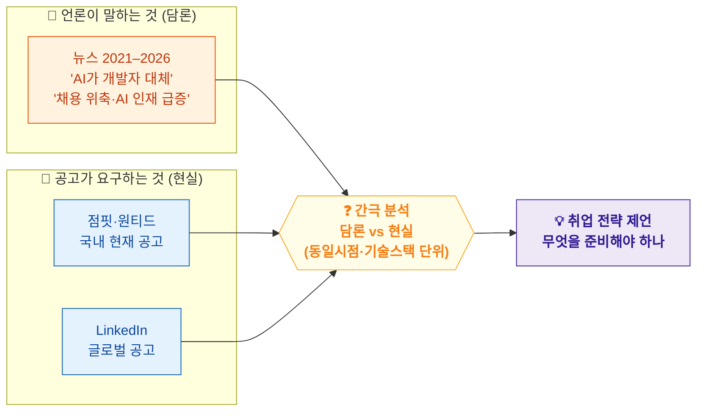

# 💡 프로젝트 아이디어 요약

## 생성형 AI 시대, 기업은 정말 어떤 개발자를 원하는가?

> **핵심 한 줄:** 언론은 "AI가 개발자를 대체한다"고 말한다. 그런데 **실제 채용공고**도 그렇게 말하고 있을까?
> → **담론(뉴스)** 과 **현실(채용공고)** 의 간극을 텍스트마이닝으로 검증한다.

---

## 1. 왜 이 주제인가

생성형 AI(ChatGPT, Copilot 등) 확산 이후 "개발자 채용 위축", "주니어 위기", "AI 인재 급증" 같은 담론이 언론에 쏟아진다. 하지만 **실제 채용공고는 여전히 Java·React·SQL·AWS 같은 실무 역량을 요구**하고 있을 가능성이 크다.

즉, **"언론이 말하는 채용시장"과 "공고에 적힌 실제 요구역량" 사이에 간극**이 있을 수 있다. 본 프로젝트는 이 간극을 데이터로 직접 확인한다.

- 팀원 전원이 **IT 취업 준비 당사자** → 본인이 체감하는 문제에서 출발 (동기 명확)
- 청년 취업난·개발자 채용 변화 **통계/보고서**로 근거 보강 가능

## 2. 핵심 아이디어 한눈에

## 3. 연구 질문

- **RQ1.** 국내 IT 공고가 지금 가장 많이 요구하는 역량은? *(점핏·원티드)*
- **RQ2.** 글로벌 공고의 요구역량·AI 역량은 어떻게 나타나는가? *(LinkedIn)*
- **RQ3.** 국내 뉴스의 개발자 채용 담론은 2021–2026 어떻게 변했나? *(뉴스)*
- **RQ4. 언론 담론과 실제 요구역량은 일치하는가?** ← **핵심** — 기술스택 간극(RQ4a) + 담론 프레임 강도(RQ4b)로 분리 측정
- **RQ5.** 국내 vs 글로벌 요구역량 격차(lag)는 얼마나 되는가? *(국내공고 × LinkedIn)*
- *(보조)* **RQ6.** 공고 텍스트로 직무군을 분류할 수 있는가? *(모델링)*

## 4. 데이터 3종 (역할 분리)

| 데이터 | 수집 방식 | 역할 | 시계열 |
|---|---|---|---|
| 🇰🇷 **점핏·원티드 채용공고** | 공개 JSON 크롤링 | 국내 **현재** 실제 요구역량 | 현재 단면 |
| 🌍 **LinkedIn 채용공고** | Kaggle 공개 데이터 | 글로벌 **현실**(적극) + 고급분석 무대 | 2023–24 |
| 📰 **빅카인즈 뉴스** | 키워드 검색 | 국내 담론 분석 | **2021–26 장기** |

🔗 **출처:** [점핏](https://www.jumpit.co.kr/) · [원티드](https://www.wanted.co.kr/) · [LinkedIn 데이터셋](https://www.kaggle.com/datasets/arshkon/linkedin-job-postings) · [빅카인즈](https://www.bigkinds.or.kr/)

> 세 데이터의 역할을 엄격히 나눈 게 설계의 핵심. "변화(before/after)" 서사는 **뉴스에만**, 국내공고(점핏·원티드)는 **현재 현실**을 담당.

## 5. 방법론 (수업 외 = 가산점)

TF-IDF · Co-occurrence Network · **Word2Vec · BERTopic · UMAP** · 직무군 분류 모델(Accuracy/F1/Confusion Matrix)

## 6. 가산점 5축

①공공 **API** 활용 ②임베딩·**BERTopic** 등 고급 방법론 ③생성형 AI 시대라는 **시의성 있는 도메인** ④청년 취업 **통계로 근거** ⑤"기업은 어떤 개발자를 원하는가" **단일 메시지 발표**

## 7. 예상 결론

*(아래는 검증할 가설)* AI가 개발자를 *대체*한다기보다, **AI·데이터·클라우드 역량이 기존 실무 역량과 결합**되는 방향으로 채용시장이 움직일 것이다. 또한 **글로벌은 이미 Python/Data/AI로 이동, 국내는 격차(lag)** 가 있을 것이다.
→ 취준생은 유행하는 단일 AI 기술이 아니라 **"실무 개발역량 + AI 활용 능력"의 조합**을 준비해야 한다.

---
📄 상세 설계·파이프라인·일정·역할분담은 **`텍스트마이닝_프로젝트_기획서.md`** 참고
